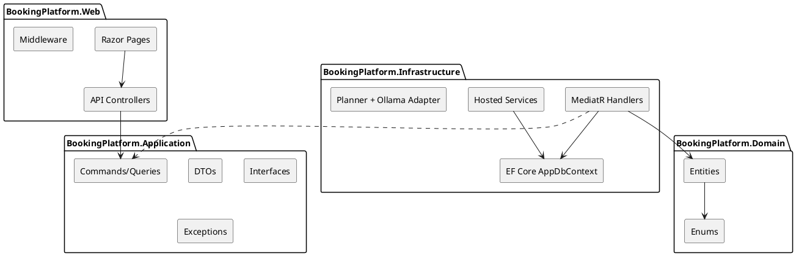
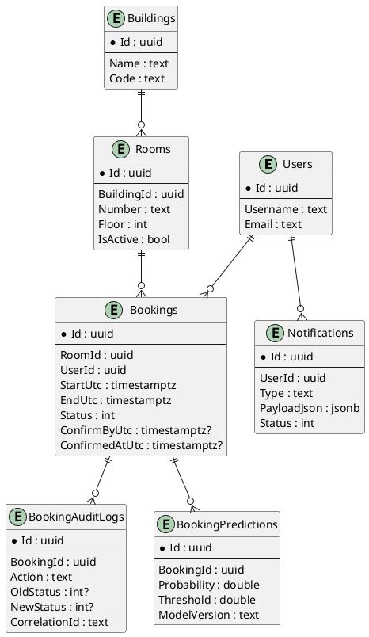
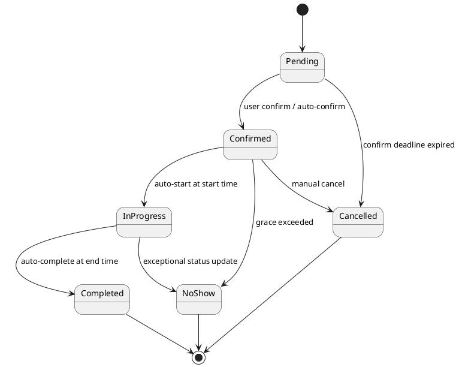
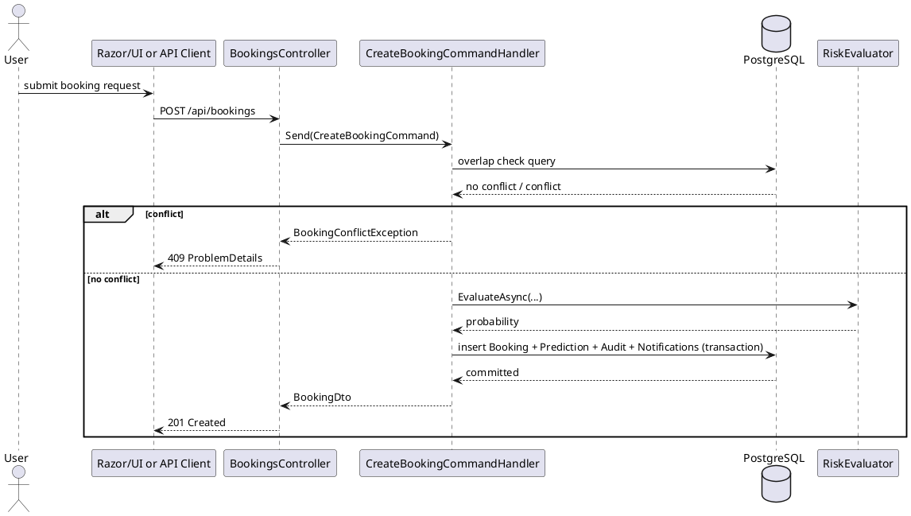
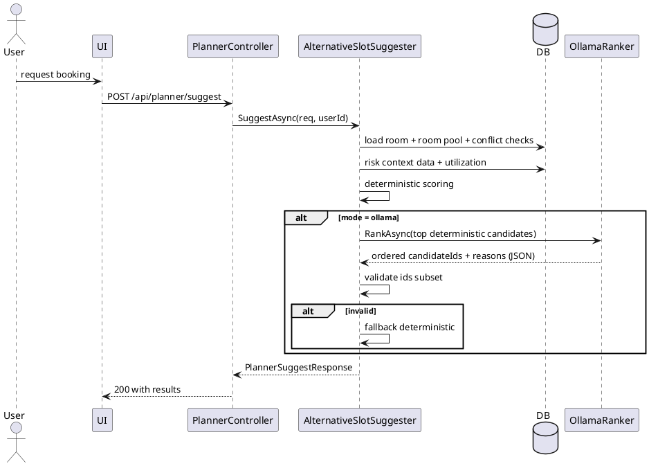
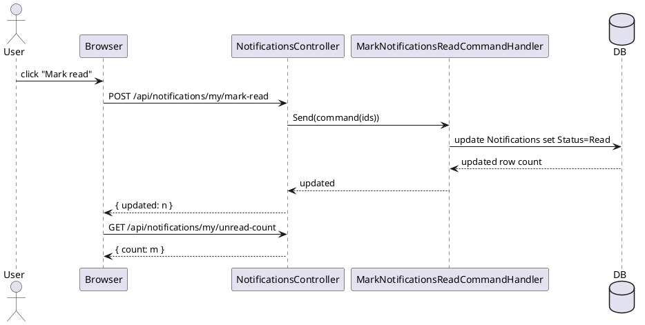

# BookingPlatform Technical Documentation
Version: 1.0  
Date: February 18, 2026  
Audience: Engineering, QA, DevOps, Product

---

## 1. Executive Summary

BookingPlatform is a .NET 8 resource booking system designed around a clean layered architecture with CQRS-style command/query separation. The platform provides room booking APIs, Razor Pages for user and admin workflows, automated booking lifecycle processing, risk-aware booking decisions, and intelligent scheduling alternatives.

The current implementation emphasizes:

- correctness of booking behavior (overlap checks, status transition rules, deadline checks);
- operational reliability (background lifecycle processor, transactional writes, structured error responses);
- traceability (booking audit log and correlation identifiers);
- extensibility (MediatR handlers, options-based configuration, optional Ollama integration for ranking);
- practical UX (Razor UI pages for booking creation, lifecycle actions, notifications, and alternatives).

This document explains implemented technologies, architecture, key flows, data model, integration boundaries, and operational guidance. It also includes PlantUML diagrams that can be rendered in standard PlantUML tooling.

[[PAGEBREAK]]

## 2. Technology Stack and Implemented Components

### 2.1 Runtime and Language

- .NET 8 (`net8.0`)
- C# (modern async/await patterns, nullable enabled)

### 2.2 Web/API Layer

- ASP.NET Core Web Application
- REST API Controllers
- Razor Pages (user and admin surfaces)
- Swagger / OpenAPI (`AddSwaggerGen`)

### 2.3 Application Layer Patterns

- MediatR for CQRS-style request handling
- Request contracts in `BookingPlatform.Application`
- Handler implementations in `BookingPlatform.Infrastructure`
- Explicit command/query classes for bookings, auth, planner, notifications

### 2.4 Persistence and Data Access

- Entity Framework Core (Npgsql provider)
- PostgreSQL as primary database
- Code-first migrations under `BookingPlatform.Infrastructure/Persistence/Migrations`
- JSONB columns for flexible payloads (`Notification.PayloadJson`, `BookingPrediction.FeaturesJson`)

### 2.5 Security and Identity

- JWT Bearer authentication for API endpoints
- Refresh token flow
- Role-based authorization policy (`AdminOnly`)
- Cookie-based token storage used by Razor Pages login-first flow

### 2.6 Reliability and Operations

- Hosted background service for autonomous booking lifecycle transitions
- Global ProblemDetails error handling (`IExceptionHandler`)
- Correlation middleware and trace propagation
- Transaction boundaries for critical booking + audit + notification mutations

### 2.7 UX Stack

- Razor Pages
- Bootstrap 5
- jQuery (AJAX workflows, UI refresh, badges, panels)

### 2.8 Testing

- Integration tests project
- xUnit
- Testcontainers PostgreSQL

[[PAGEBREAK]]

## 3. Architectural Overview

The solution is organized into four principal projects:

- `BookingPlatform.Domain`: entities and enums.
- `BookingPlatform.Application`: DTOs, commands, queries, interfaces, cross-cutting contracts.
- `BookingPlatform.Infrastructure`: EF Core context, MediatR handlers, services, integrations, migrations.
- `BookingPlatform.Web`: API controllers, Razor Pages, middleware, service registration.

This design keeps business contracts stable while allowing implementation changes behind interfaces.

### 3.1 Layer Responsibilities

- Domain: persistence-agnostic core model.
- Application: use-case contracts and shared exceptions.
- Infrastructure: execution of use-cases, data access, transaction orchestration.
- Web: transport concerns (HTTP, auth middleware, ProblemDetails, Swagger, UI).

### 3.2 Dependency Direction

- Domain has no dependency on other solution layers.
- Application depends on Domain abstractions/types where needed.
- Infrastructure depends on Application and Domain.
- Web depends on Application and Infrastructure.

### 3.3 PlantUML - Layer Diagram



[[PAGEBREAK]]

## 4. Data Model and Persistence Strategy

### 4.1 Core Tables

Major persisted aggregates include:

- `Users`
- `Buildings`
- `Rooms`
- `Bookings`
- `BookingAuditLogs`
- `BookingPredictions`
- `Notifications`
- `RefreshTokens`
- dictionary reference tables (`ref.UserRoles`, `ref.RoomTypes`)

### 4.2 Booking Model Highlights

Booking contains:

- room and user references;
- UTC interval (`StartTimeUtc`, `EndTimeUtc` mapped to `StartUtc`, `EndUtc`);
- lifecycle fields (`Status`, `ConfirmByUtc`, `ConfirmedAtUtc`);
- business metadata (`Purpose`, `CreatedAtUtc`).

Implemented booking statuses:

- Pending
- Confirmed
- InProgress
- Completed
- Cancelled
- NoShow

### 4.3 Notifications Model Highlights

Notification contains:

- `UserId`
- `Type`
- `PayloadJson` (JSONB)
- `Status` (`Pending`, `Sent`, `Failed`, `Read`)
- timestamps and optional delivery error fields.

### 4.4 Audit and Prediction

- `BookingAuditLogs` records user/system actions and old/new status changes with correlation context.
- `BookingPredictions` stores risk outputs (`Probability`, `Threshold`, `PredictedLabel`, `ModelVersion`, `FeaturesJson`).

### 4.5 PlantUML - Simplified ER Diagram



[[PAGEBREAK]]

## 5. Booking Domain Behavior

### 5.1 Overlap Prevention

The booking creation handler enforces interval overlap checks for active blocking statuses:

- Pending
- Confirmed
- InProgress

Predicate:

- same room,
- blocking status,
- `existing.Start < requested.End` and `existing.End > requested.Start`.

When conflict is detected, a domain-specific exception is thrown and mapped to HTTP 409 ProblemDetails.

In addition, handler logic maps PostgreSQL exclusion violations (`23P01`) to conflict exceptions when such DB constraint is present in deployed schema.

### 5.2 Status Transition Rules

Implemented transitions:

- Pending -> Confirmed | Cancelled
- Confirmed -> InProgress | Cancelled | NoShow
- InProgress -> Completed | NoShow
- Completed -> terminal
- Cancelled -> terminal
- NoShow -> terminal

Invalid transitions throw `BookingInvalidStatusTransitionException`.

### 5.3 Adaptive Confirmation

Create booking path evaluates no-show probability and compares with configured threshold:

- if probability >= threshold -> booking remains Pending and requires confirmation by deadline;
- else -> booking is auto-confirmed immediately.

This reduces friction for low-risk users while preserving controls for higher-risk bookings.

### 5.4 Risk Evaluation (Heuristic)

Current evaluator (`heuristic-v1`) starts with base score and adds risk increments for:

- repeated no-shows,
- short lead time,
- long duration,
- evening slots.

Output is clamped and persisted in `BookingPredictions` for transparency.

[[PAGEBREAK]]

## 6. Autonomous Lifecycle Engine

A hosted background processor (`BookingLifecycleHostedService`) periodically executes lifecycle automation.

### 6.1 Automated Transitions

Per run, processor performs ordered batches:

1. Pending -> Cancelled when confirmation deadline expired.
2. Confirmed -> InProgress when start time reached (if enabled).
3. InProgress -> Completed when end time reached (if enabled).
4. Confirmed -> NoShow after grace window.

### 6.2 Idempotency and Consistency

- Uses deterministic candidate selection and batching.
- Updates are performed in a transaction.
- Writes audit logs (`Action = SystemJob`) and notifications for each automatic transition.

### 6.3 Configuration

`BookingLifecycleJobOptions`:

- `IntervalSeconds`
- `NoShowGraceMinutes`
- `AutoStartEnabled`
- `AutoCompleteEnabled`

### 6.4 PlantUML - State Machine



[[PAGEBREAK]]

## 7. API Surface and Error Model

### 7.1 Major API Areas

- Auth (`/api/auth/register`, `/api/auth/login`, `/api/auth/refresh`)
- Buildings and Rooms CRUD endpoints
- Booking lifecycle endpoints:
  - create,
  - status update,
  - confirm,
  - delete,
  - risk retrieval.
- Planner endpoints:
  - `/api/planner/propose` (proposal mode),
  - `/api/planner/suggest` (alternative suggestions with optional AI ranking).
- Notifications endpoints:
  - `/api/notifications/my`
  - `/api/notifications/my/unread-count`
  - `/api/notifications/my/mark-read`
  - `/api/notifications/my/mark-all-read`
- Admin lifecycle trigger:
  - `/api/admin/lifecycle/run`

### 7.2 ProblemDetails and Exception Mapping

Global exception handler maps known domain failures to stable API contracts:

- booking conflicts -> 409
- non-confirmable/expired/invalid transitions -> 409
- key not found -> 404
- forbidden -> 403
- invalid operation -> 400
- unexpected exception -> 500

Response extensions include `correlationId` and `traceId` to simplify troubleshooting.

### 7.3 PlantUML - Sequence for Booking Creation



[[PAGEBREAK]]

## 8. Planner and AI-Assisted Alternative Suggestions

The planner subsystem provides deterministic and optionally AI-reordered alternatives when the requested slot is busy.

### 8.1 Deterministic Candidate Generation

`IAlternativeSlotSuggester` builds candidates by:

- validating request interval and room activity;
- generating time buckets around requested time within configured working hours;
- ordering rooms by proximity (same floor/building first);
- checking every candidate against DB for overlap conflicts;
- enriching candidates with no-show risk and utilization;
- computing a deterministic weighted score.

Only DB-validated free candidates are allowed in the result.

### 8.2 Optional Ollama Ranking

`IOllamaRanker` may reorder deterministic candidates using local Ollama.

Safety controls:

- strict JSON-only response contract;
- output candidate IDs must be subset of input;
- short timeout;
- automatic fallback to deterministic order when validation fails.

### 8.3 PlantUML - Planner Suggest Flow



[[PAGEBREAK]]

## 9. Notifications and User Experience

### 9.1 Notification Generation

Notifications are emitted from booking handlers and lifecycle processor for events such as:

- booking created,
- needs confirmation,
- confirmed,
- auto-confirmed,
- expired,
- started,
- completed,
- cancelled,
- no-show.

### 9.2 Notification APIs

Current user can:

- list notifications with pagination/filter,
- get unread count,
- mark selected notifications as read,
- mark all unread notifications as read.

Queries are filtered by current user in SQL, preventing cross-user data access.

### 9.3 Razor UX

- navbar badge refreshes unread count periodically;
- `/Notifications` page supports `All` and `Unread` filters;
- per-item and bulk mark-read actions run via AJAX;
- booking creation page integrates suggestion panel when 409 conflict occurs.

### 9.4 PlantUML - Notification Read Flow



[[PAGEBREAK]]

## 10. Security, Observability, and Operational Guidance

### 10.1 Security Model

- APIs are protected by JWT Bearer except explicitly anonymous auth endpoints.
- Admin actions use policy-based authorization.
- User-scoped queries and updates rely on `IRequestContextAccessor` and claim/cookie resolution.
- Notifications and booking actions are constrained to current user context where applicable.

### 10.2 Observability

- Global exception handling with ProblemDetails.
- Correlation ID middleware.
- Trace and correlation fields in API error responses.
- Audit records for booking lifecycle events.

### 10.3 Configuration Areas

Important app settings sections:

- `ConnectionStrings`
- `Jwt`
- `BookingLifecycleJob`
- `RiskPolicy`
- `Planner`
- `Ollama`

### 10.4 Build, Migrations, and Environment

Typical workflow:

1. restore and build solution;
2. apply EF migrations to PostgreSQL;
3. run web host;
4. execute integration tests with Testcontainers-enabled Docker runtime.

### 10.5 Risks and Improvement Opportunities

- complete DB-level exclusion constraint migration in all environments if not already enabled;
- add structured telemetry exporters (OpenTelemetry) for production monitoring;
- harden token storage and rotation strategy for browser clients;
- add deeper API integration test coverage for planner and notifications endpoints;
- expand notification delivery channels beyond in-app storage.

[[PAGEBREAK]]

## Appendix A. PlantUML Rendering Instructions

To render the diagrams:

1. Copy each `@startuml ... @enduml` block into a `.puml` file.
2. Use PlantUML CLI or IDE plugin.
3. Export as PNG/SVG for wiki or architecture review decks.

CLI example:

```bash
plantuml architecture-layered.puml
```

## Appendix B. Glossary

- CQRS: Command Query Responsibility Segregation.
- ProblemDetails: RFC 7807 structured API error payload.
- UTC: Coordinated Universal Time.
- No-show: booking that was not attended within grace window.
- Deterministic ranking: ranking fully computed by server logic without LLM dependency.

---

End of document.
